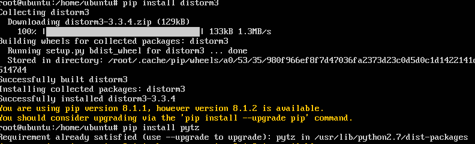
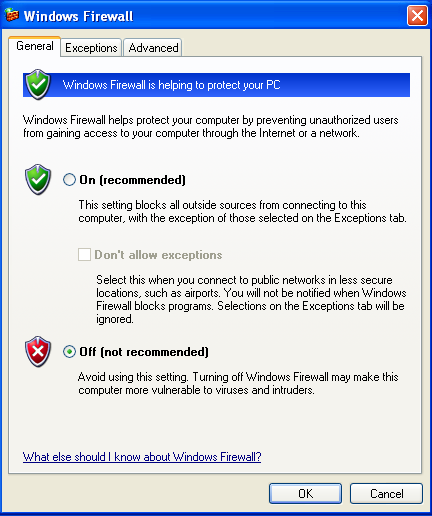

# PKSJ - Tugas 3

## Pendahuluan

**Anggota Kelompok**

| NRP         | Nama                     |
|-------------|--------------------------|
| 5113100050  | Freddy Hermawan Y        |
| 5113100109  | Daniel Fablius           |
| 5113100113  | Muhamad Luthfie La Roeha |

#### Penjelasan Tugas
**Tugas 3 :**
* Instal Cuckoo Sandbox
* Analisislah malware yang terdapat pada file dengan tipe .xls


## Dasar Teori


**1. Cuckoo Sandbox**

* **Cuckoo Sandbox** adalah 
salah satu sistem yang digunakan untuk mengalisa malware / file yang mencurigakan yang terdapat didalam system dan memberikan hasil yang terperinci mengenai apa yang terjadi dan apa yang telah dilakukan oleh malware / file yang mencurigakan tersebut dalam hitungan detik.Cuckoo ini biasanya digunakan untuk mengetes malware yang ada didalam suatu lingkungan yang terisolasi.Dapat dijalankan diatas multiplaform OS.(https://cuckoosandbox.org)

* **Malware** adalah 
suatu sofware atau suatu file applikasi / suatu file tertentu yang disisipi dengan menggunakan code tertentu yang digunakan untuk mengambil data yang sensitif, atau mengganggu jalannya operasi komputer, atau mendapatkan suatu hak akses khusus, atau menampilkan iklan iklan yang tidak diinginkan. (https://en.wikipedia.org/wiki/Malware)

**2. Malware yang digunakan**


## Persiapan

#### 1. Langkah Instalasi Cuckoo

  1. Pada Host OS(dalam kasus ini kami menggunakan host OS berbasis Linux) dengan menggunakan perintah untuk menginstall software - software prasyarat yang akan nantinya digunakan oleh Cuckoo
  ```
  $ sudo apt-get install git mongodb libffi-dev build-essential python-django python python-dev python-pip python-pil python-sqlalchemy python-bson python-dpkt python-jinja2 python-magic python-pymongo python-gridfs python-libvirt python-bottle python-pefile python-chardet tcpdump -y
  ```


  2. Mengkonfigurasi Tcpdump
  ```
  $ $ sudo setcap cap_net_raw,cap_net_admin=eip /usr/sbin/tcpdump
  $ getcap /usr/sbin/tcpdump
  ```


  3. Menginstall Yara dan memvalidasinya 
  ```
	$ sudo apt-get install autoconf libtool libjansson-dev libmagic-dev libssl-dev -y
	$ wget https://github.com/plusvic/yara/archive/v3.4.0.tar.gz -O yara-3.4.0.tar.gz
	$ tar -zxf yara-3.4.0.tar.gz
	$ cd yara-3.4.0
	$ ./bootstrap.sh
	$ ./configure --with-crypto --enable-cuckoo --enable-magic
	$ make
	$ sudo make install
	$ yara -v
  ```


  4. Menginstal extensi yara-python dan validasinya
  ```
  $ cd yara-python
  $ python setup.py build
  $ sudo python setup.py install
  $pip show yara-python
  ```


  5. Menginstall Pydeep dan validasi
  ```
  $ wget http://sourceforge.net/projects/ssdeep/files/ssdeep-2.13/ssdeep-2.13.tar.gz/download -O ssdeep-2.13.tar.gz
  $ tar -zxf ssdeep-2.13.tar.gz
  $ cd ssdeep-2.13
  $ ./configure
  $ make
  $ sudo make install
  $ ssdeep -V
  $ pip install pydeep
  $ pip show pydeep
  ```


  6. Menginstall prasyarat Volatility yang digunakan untuk analisis forensik pada memory dumps. Seperti openpyxl,ujson,pycrypto,distorm3,pytz
  ```
  $ pip install openpyxl
  $ pip install ujson
  $ pip install pycrypto
  $ pip install distorm3
  $ pip install pytz 
  ```




  7. Menginstall dan validasi Volatility
  ```
  $ git clone https://github.com/volatilityfoundation/volatility.git
  $ cd volatility
  $ python setup.py build
  $ python setup.py install
  $ python vol.py -h
  ```

  
  8. Mendownload dan menginstall Cuckoo
  ```
  $ git clone git://github.com/cuckoosandbox/cuckoo.git
  ```

  
  9. Menambahkan user Cuckoo
  ```
  $ useradd cuckoo
  ```

  10. Memastikan bahwa user yang merun Cuckoo ada user tersebut 
  ```
  $ chown -R cuckoo:cuckoo /home/cuckoo/cuckoo
  ```

#### 2. Menyiapkan Guest OS (dalam kasus ini menggunakan Microsoft Windows XP)
	Dalam kasus ini kita guest OSnya akan kami install didalam VirtualBox
  1. Menginstall VirtualBox
	```
	$ sudo apt-get install vitualbox
	```


  2. menambahkan user cuckoo kedalam vboxuser group
	```
	$ sudo usermod -a -G vboxusers cuckoo
	```
	
  3. Membuat Virtual Machinenya dalam kasus ini namanya windowsxp
	```
	$ vboxmanage createvm --name "windowsxp" --ostype WindowsXP --register  
	$ vboxmanage modifyvm "windowsxp" --memory 1000 --acpi on --boot1 dvd --nic1 nat  
	$ vboxmanage createhd --filename "windowsxp.vdi" --size 12000
	$ vboxmanage storagectl "windowsxp" --name "IDE Controller" --add ide --controller PIIX4  
	$ vboxmanage storageattach "windowsxp" --storagectl "IDE Controller" --port 0 --device 0 --type hdd --medium "windowsxp.vdi"  
	$ vboxmanage storageattach "windowsxp" --storagectl "IDE Controller" --port 0 --device 1 --type dvddrive --medium /home/cuckoo/windowsxpsp3.iso
	$ vboxmanage hostonlyif create
	$ vboxmanage modifyvm "windowsxp" --nic1 hostonly  
	$ vboxmanage modifyvm "windowsxp" --hostonlyadapter1 vboxnet0
	```
	
  4. Membuat folder share yang digunakan untuk mentransfer data(Cuckoo agent) dari Host to Guest OS
	```
	$ mkdir -p /home/cuckoo/VirtualBox VMs/windowsxpshare
	$ vboxmanage sharedfolder add "windowsxp" --name "windowsxpshare" --hostpath /home/cuckoo/VirtualBox VMs/windowsxpshare --automount 
	$ cp /home/cuckoo/cuckoo/agent/agent.py /home/cuckoo/VirtualBox VMs/windowsxpshare/agent.py
	```
	
  5. Mengisolasi seluruh network dengan guest OS dengan cara Host-Only adapter 
	```
	$ sudo iptables -A FORWARD -o eth0 -i vboxnet0 -s 192.168.56.0/24 -m conntrack --ctstate NEW -j ACCEPT
	$ sudo iptables -A FORWARD -m conntrack --ctstate ESTABLISHED,RELATED -j ACCEPT
	$ sudo iptables -A POSTROUTING -t nat -j MASQUERADE
	$ sudo sysctl -w net.ipv4.ip_forward=1
	```
	
  6. Menginstall Guest OS
	```
	$ vboxmanage startvm "windowsxp"
	```

  
  7. Mengkonfigurasi guest OS network


  8. Mematikan Windows Update dan Windows Firewall




  9. Menginstall Python 2.7


  10. Mengaktifkan untuk menshare dari Host to Guest OS. Langkah langkahnya :

		1. Pada bagian Device  -> Insert Guest Additions CD Image

		2. My Computer -> My Network Places -> Add a network place

		3. Click Browse

		4. windowsxpshare on Vboxsrv


  11. Mengcopy agent.py yang terdapat dalam folder cuckoo/agent kedalam folder sharenya tersebut dan nantinya dari sana akan dipindah lagi ke `C:\\Documents and Settings\All Users\Start Menu\Programs\Startup`


  
  12. Mengambil Snapshot
	```
	$ vboxmanage snapshot "windowsxp" take "snapshot1" --pause
	$ vboxmanage controlvm "windowsxp" poweroff
	$ vboxmanage snapshot "windowsxp" restorecurrent
	```
  13. Konfigurasi Cuckoo
	1. file cuckoo.conf
		```
		machinery = virtualbox
		[resultserver]
		ip = 192.168.56.1 #This is the IP address of the host
		port = 2042 #leave default unless you have services running
		```
	2. file auxiliary.conf
		```
		[sniffer]
		# Enable or disable the use of an external sniffer (tcpdump) [yes/no].
		enabled = yes

		# Specify the path to your local installation of tcpdump. Make sure this
		# path is correct.
		# You can check this using the command: whereis tcpdump
		tcpdump = /usr/sbin/tcpdump

		# Specify the network interface name on which tcpdump should monitor the
		# traffic. Make sure the interface is active.
		```
	3. file virtualbox.conf
		```
		# The ifconfig command will show you the interface name.
		interface = vboxnet0
		machines = windowsxp

		[windowsxp]
		label = windowsxp
		platform = windows
		ip = 192.168.56.10 # IP address of the guest
		snapshot = snapshot1 # name of snapshot
		```
	4. file report.conf

		```
		[mongodb]
		enabled = yes
		```
  14. run cuckoo pada terminal

	```
	$ cd /home/cuckoo/cuckoo
	$ python cuckoo.py
	```

	
  15. run cuckoo pada web interface
	```
	$ cd /home/cuckoo/cuckoo/web
	$ python manage.py runserver
	```
	

  
	
**Skenario 1** : 


####2. Uji Malware 


**Skenario 2** : 


####3. Uji Malware


## Kesimpulan dan Saran
